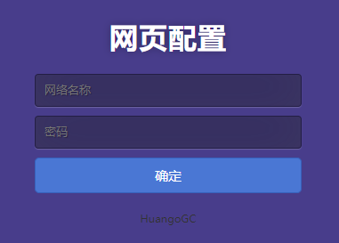

# ESP8266 Webconfig 网页配置
## ESP8266 NONOS SDK 网页配置连接的WIFI

  

### 使用方法

1. 编译下载bin文件
2. 下载html文件,文件选择所有类型,选择0xD0000.html(地址为0xD0000)
3. 重启ESP8266
7. 使用手机或电脑连接WiFi：webconfig
8. 浏览器输入：192.168.4.1
9. 填写AP信息并确认

