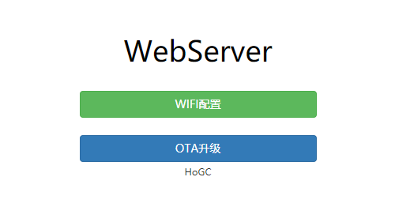
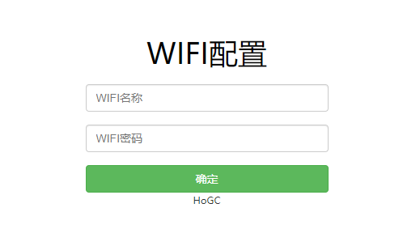
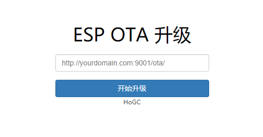

# ESP8266 WebServer 网页服务
## ESP8266 NONOS SDK 内网配置WIFI+内网OTA升级

  

### 使用方法

1. 修改代码user_main.c的WiFi信息
2. 编译下载bin文件
3. 重启ESP8266
4. 访问ESP8266 IP地址(路由后台或8266打印信息)

### WIFI配置界面

### OTA升级界面

### 相关驱动
1. ota derver:https://github.com/HoGC/esp8266_driver/tree/master/ota
2. webconfig derver:https://github.com/HoGC/esp8266_driver/tree/master/webconfig

